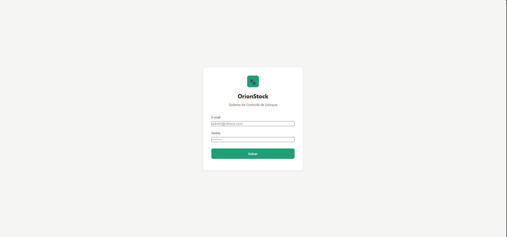
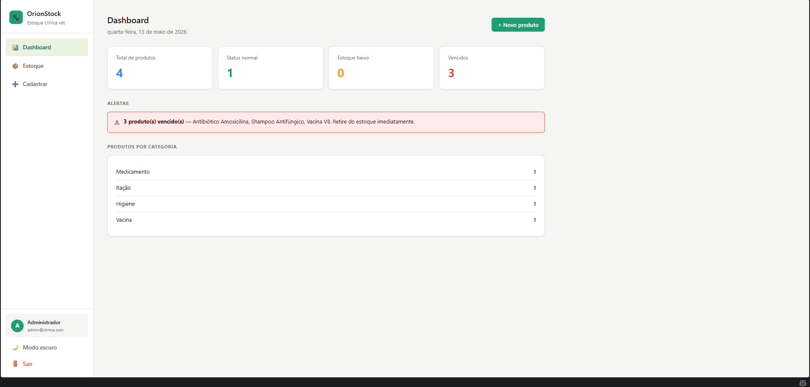
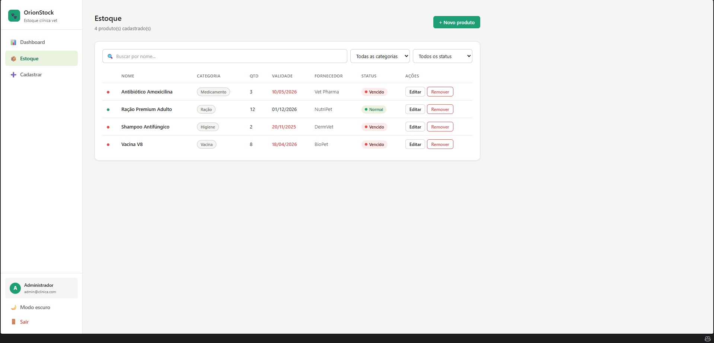
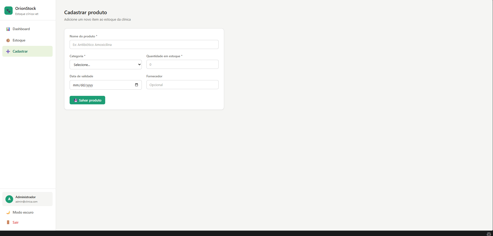
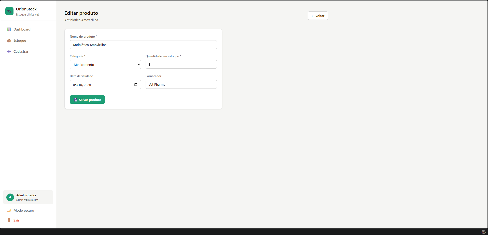

# OrionStock

O OrionStock é um sistema simples para ajudar uma clínica veterinária a cuidar do estoque do dia a dia.

A ideia é centralizar o cadastro dos produtos, acompanhar quantidades disponíveis e destacar rapidamente o que precisa de atenção, como itens vencidos, produtos acabando ou produtos que estão perto da validade.

## Em resumo

Com o OrionStock, a clínica consegue:

- entrar no sistema com usuário e senha;
- visualizar um painel geral do estoque;
- cadastrar novos produtos;
- editar informações de produtos já cadastrados;
- remover produtos que não fazem mais parte do estoque;
- buscar e filtrar produtos por nome, categoria e status;
- identificar produtos vencidos;
- identificar produtos com estoque baixo;
- identificar produtos que vencem nos próximos 7 dias;
- alternar entre tema claro e escuro;
- sair da conta com segurança.

## Como o sistema funciona

O projeto é dividido em duas partes:

- **Frontend:** a tela que o usuário acessa no navegador.
- **Backend:** a API que faz login, protege as rotas e conversa com o Supabase.

O frontend foi feito com React e Vite. O backend foi feito com Node.js, Express e Supabase.

Quando o usuário faz login, o backend valida o e-mail e a senha, gera um token JWT e o frontend guarda essa sessão no `localStorage`. Depois disso, todas as telas internas passam a usar esse token para acessar os produtos.

## Tecnologias usadas

- React
- Vite
- React Router
- Axios
- Node.js
- Express
- Supabase
- JWT
- bcryptjs
- ESLint

## Interface do sistema

### Página de login


### Dashboard


### Estoque


### Cadastro de produto


### Editar produto


## Estrutura do projeto

```text
orionstock/
+-- backend/
|   +-- routes/
|   |   +-- auth.js
|   |   +-- produtos.js
|   +-- middleware/
|   |   +-- autenticar.js
|   +-- db.js
|   +-- server.js
|   +-- supabase.js
+-- src/
|   +-- components/
|   +-- pages/
|   +-- services/
|   |   +-- api.js
|   +-- App.jsx
|   +-- main.jsx
+-- db.json
+-- package.json
+-- vite.config.js
```

## Antes de começar

Você vai precisar ter instalado:

- Node.js;
- npm;
- uma conta/projeto no Supabase.

Também é necessário ter duas tabelas no Supabase:

- `usuarios`;
- `produtos`.

## Configurando o Supabase

Crie a tabela de usuários:

```sql
create table usuarios (
  id uuid primary key default gen_random_uuid(),
  email text not null unique,
  senha text not null,
  nome text not null
);
```

Crie a tabela de produtos:

```sql
create table produtos (
  id uuid primary key default gen_random_uuid(),
  nome text not null,
  categoria text not null,
  quantidade integer not null default 0,
  validade date,
  fornecedor text
);
```

Se o seu projeto no Supabase estiver com RLS habilitado, configure as permissões necessárias para que a API consiga ler, criar, editar e remover produtos.

## Configurando o backend

Dentro da pasta `backend`, crie um arquivo chamado `.env`:

```env
PORT=3001
SUPABASE_URL=https://seu-projeto.supabase.co
SUPABASE_KEY=sua-chave-do-supabase
JWT_SECRET=uma-chave-secreta-para-assinar-tokens
ADMIN_EMAIL=admin@clinica.com
ADMIN_SENHA=123456
```

Essas variáveis dizem ao backend onde está o Supabase, qual chave usar para conectar, qual segredo usar para gerar o token de login e qual será o usuário administrador inicial.

Quando o backend inicia, ele tenta criar automaticamente o usuário administrador definido em `ADMIN_EMAIL` e `ADMIN_SENHA`, caso esse usuário ainda não exista. Ele também cria alguns produtos de exemplo se a tabela `produtos` estiver vazia.

## Instalando o projeto

Na raiz do projeto, instale as dependências do frontend:

```bash
npm install
```

Depois instale as dependências do backend:

```bash
cd backend
npm install
```

## Rodando o projeto

Use dois terminais: um para o backend e outro para o frontend.

No primeiro terminal, inicie a API:

```bash
cd backend
npm start
```

Se tudo estiver certo, o backend ficará disponível em:

```text
http://localhost:3001
```

No segundo terminal, volte para a raiz do projeto e inicie o frontend:

```bash
npm run dev
```

O Vite vai mostrar uma URL local, normalmente:

```text
http://localhost:5173
```

Acesse essa URL no navegador e entre pela tela de login usando o e-mail e a senha definidos no arquivo `backend/.env`.

## Configuração opcional do frontend

Por padrão, o frontend chama a API em `http://localhost:3001`.

Se precisar usar outra URL, crie um arquivo `.env` na raiz do projeto:

```env
VITE_API_URL=http://localhost:3001
```

## Como testar o sistema

Use este roteiro para conferir se o projeto está funcionando como esperado.

### 1. Verificar se a API está online

Com o backend rodando, acesse:

```text
http://localhost:3001
```

Resultado esperado: o navegador deve mostrar uma resposta em JSON dizendo que a API está rodando.

### 2. Testar o login

1. Abra o frontend no navegador.
2. Acesse `/login`.
3. Digite o e-mail e a senha configurados em `backend/.env`.
4. Clique em Entrar.

Resultado esperado: o sistema deve abrir o dashboard.

Se o e-mail ou a senha estiverem errados, o sistema deve mostrar uma mensagem de erro.

### 3. Testar as rotas protegidas

1. Clique em Sair ou limpe o `localStorage` do navegador.
2. Tente acessar `/`, `/produtos` ou `/cadastro`.

Resultado esperado: o sistema deve mandar o usuário de volta para `/login`.

### 4. Testar a listagem de produtos

1. Faça login.
2. Acesse a tela Estoque.

Resultado esperado: a tabela deve listar os produtos cadastrados no Supabase.

### 5. Testar busca e filtros

Na tela Estoque:

1. Pesquise um produto pelo nome.
2. Filtre por categoria.
3. Filtre por status.

Resultado esperado: a tabela deve mostrar apenas os produtos que combinam com os filtros aplicados.

Os status são calculados assim:

- **Vencido:** produto com validade menor ou igual à data atual.
- **Estoque baixo:** produto com quantidade menor que 5.
- **Normal:** produto não vencido e com quantidade maior ou igual a 5.

Se um produto estiver vencido e também com estoque baixo, ele aparece como vencido, porque a validade tem prioridade.

### 6. Testar cadastro de produto

1. Acesse Cadastrar.
2. Preencha nome, categoria e quantidade.
3. Se quiser, preencha também validade e fornecedor.
4. Clique em Salvar produto.

Resultado esperado: o sistema deve mostrar uma mensagem de sucesso e limpar o formulário.

Também vale testar deixando campos obrigatórios vazios. Nesse caso, o sistema deve avisar que nome, categoria e quantidade são obrigatórios.

### 7. Testar edição de produto

1. Acesse Estoque.
2. Clique em Editar em algum produto.
3. Altere uma ou mais informações.
4. Salve.

Resultado esperado: o sistema deve mostrar uma mensagem de sucesso e voltar para a tela Estoque.

### 8. Testar remoção de produto

1. Acesse Estoque.
2. Clique em Remover.
3. Confirme a remoção.

Resultado esperado: o produto removido deve sair da tabela.

### 9. Testar o dashboard

1. Acesse Dashboard.
2. Confira os cards de total, normal, estoque baixo e vencidos.
3. Confira os alertas exibidos abaixo dos cards.
4. Confira a lista de produtos que vencem nos próximos 7 dias.
5. Confira a quantidade de produtos por categoria.

Resultado esperado: os números do dashboard devem bater com os produtos cadastrados.

### 10. Testar tema e logout

1. Use o botão de tema claro/escuro no menu lateral.
2. Recarregue a página.
3. Clique em Sair.

Resultado esperado: o tema escolhido deve continuar salvo e o logout deve levar o usuário de volta para `/login`.

## Testando a API com curl

Faça login para receber um token:

```bash
curl -X POST http://localhost:3001/auth/login \
  -H "Content-Type: application/json" \
  -d "{\"email\":\"admin@clinica.com\",\"senha\":\"123456\"}"
```

Depois use o token nas rotas protegidas:

```bash
curl http://localhost:3001/produtos \
  -H "Authorization: Bearer SEU_TOKEN"
```

Criar um produto:

```bash
curl -X POST http://localhost:3001/produtos \
  -H "Content-Type: application/json" \
  -H "Authorization: Bearer SEU_TOKEN" \
  -d "{\"nome\":\"Seringa 5ml\",\"categoria\":\"Material\",\"quantidade\":10,\"validade\":\"2027-01-10\",\"fornecedor\":\"MedVet\"}"
```

Atualizar um produto:

```bash
curl -X PUT http://localhost:3001/produtos/ID_DO_PRODUTO \
  -H "Content-Type: application/json" \
  -H "Authorization: Bearer SEU_TOKEN" \
  -d "{\"nome\":\"Seringa 5ml\",\"categoria\":\"Material\",\"quantidade\":8,\"validade\":\"2027-01-10\",\"fornecedor\":\"MedVet\"}"
```

Remover um produto:

```bash
curl -X DELETE http://localhost:3001/produtos/ID_DO_PRODUTO \
  -H "Authorization: Bearer SEU_TOKEN"
```

## Comandos úteis

Verificar o padrão de código do frontend:

```bash
npm run lint
```

Gerar o build de produção:

```bash
npm run build
```

Visualizar o build localmente:

```bash
npm run preview
```

O backend ainda não possui testes automatizados configurados. Hoje, o script `npm test` dentro de `backend/` apenas retorna a mensagem padrão de erro.

## Rotas da API

### Rotas públicas

- `GET /`: verifica se a API está rodando.
- `POST /auth/login`: autentica o usuário e retorna o token.
- `POST /login-teste`: rota simples para teste de envio de dados.

### Rotas protegidas

Todas as rotas abaixo exigem o token JWT no header:

```text
Authorization: Bearer SEU_TOKEN
```

- `GET /produtos`: lista os produtos.
- `GET /produtos/:id`: busca um produto pelo ID.
- `POST /produtos`: cria um produto.
- `PUT /produtos/:id`: atualiza um produto.
- `DELETE /produtos/:id`: remove um produto.

## Observações importantes

- O arquivo `db.json` ainda existe no projeto e pode servir como referência de dados, mas a versão atual do backend usa Supabase.
- Existe um script `npm run server` na raiz para rodar `json-server`, porém o fluxo atual do sistema depende do backend Express, porque ele faz login com JWT e protege as rotas de produtos.
- O token JWT expira em 8 horas.
- Produtos com quantidade `0` aparecem como `Sem estoque`.
